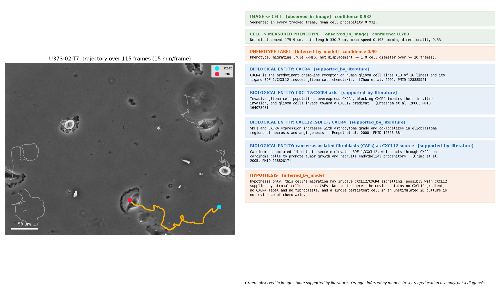

# Phases 5-6 — Biological Linking and AI Confidence: Flagship Case Study

**U373 glioblastoma cell migration -> CXCL12/CXCR4 axis (CAF-derived CXCL12)**

Research and educational system. Not a clinical diagnostic.

## Why this case study
The sprint plan names CAF/CXCL12 as the flagship. We have no CAF or A549
imaging data, so the chain is built on the public CTC U373 migration movies
from Phase 2. The literature on CXCL12/CXCR4 in glioma migration makes this
a direct fit, and the link to CAFs is kept at its real strength: it comes
from breast carcinoma, not glioma.

## Evidence levels
Every statement carries exactly one level, and they are never merged:

| Level | Meaning |
|---|---|
| `observed_directly_in_image` | Observed directly in the image (measured from segmented pixels) |
| `supported_by_literature` | Supported by published literature (not observed in this image) |
| `inferred_by_model` | Inferred by a model or rule (not an experimental fact) |

## Flagship cell: U373-02-T7

- **[observed_directly_in_image]** Cell tracked for 115 frames (28.5 h). (confidence 0.783)
- **[observed_directly_in_image]** Net displacement 175.9 um, path length 330.7 um, mean speed 0.193 um/min, directionality 0.53. (confidence 0.783)
- **[observed_directly_in_image]** Segmented in every tracked frame; mean cell probability 0.932. (confidence 0.932)
- **[inferred_by_model]** Phenotype: migrating (rule R-MIG: net displacement >= 1.0 cell diameter over >= 20 frames). (confidence 0.99)
- **[supported_by_literature]** CXCR4 is the predominant chemokine receptor on human glioma cell lines (13 of 16 lines) and its ligand SDF-1/CXCL12 induces glioma cell chemotaxis. [Zhou Y, Larsen PH, Hao C, Yong VW. CXCR4 is a major chemokine receptor on glioma cells and mediates their survival. J Biol Chem. 2002;277(51):49481-7. PMID 12388552]
- **[supported_by_literature]** Invasive glioma cell populations overexpress CXCR4, blocking CXCR4 impairs their in vitro invasion, and glioma cells invade toward a CXCL12 gradient. [Ehtesham M, Winston JA, Kabos P, Thompson RC. CXCR4 expression mediates glioma cell invasiveness. Oncogene. 2006;25(19):2801-6. PMID 16407848]
- **[supported_by_literature]** SDF1 and CXCR4 expression increases with astrocytoma grade and co-localizes in glioblastoma regions of necrosis and angiogenesis. [Rempel SA, Dudas S, Ge S, Gutierrez JA. Identification and localization of the cytokine SDF1 and its receptor, CXC chemokine receptor 4, to regions of necrosis and angiogenesis in human glioblastoma. Clin Cancer Res. 2000;6(1):102-11. PMID 10656438]
- **[supported_by_literature]** Carcinoma-associated fibroblasts secrete elevated SDF-1/CXCL12, which acts through CXCR4 on carcinoma cells to promote tumor growth and recruits endothelial progenitors. [Orimo A, Gupta PB, Sgroi DC, et al. Stromal fibroblasts present in invasive human breast carcinomas promote tumor growth and angiogenesis through elevated SDF-1/CXCL12 secretion. Cell. 2005;121(3):335-48. PMID 15882617]
- **[inferred_by_model]** Hypothesis only: this cell's migration may involve CXCL12/CXCR4 signalling, possibly with CXCL12 supplied by stromal cells such as CAFs. Not tested here: the movie contains no CXCL12 gradient, no CXCR4 label and no fibroblasts, and a single persistent cell in an unstimulated 2D culture is not evidence of chemotaxis.

## Dataset caveat
- **[supported_by_literature]** Many cell stocks labelled U-373 are the glioblastoma line U-251 due to an earlier cross-contamination, and long-term subclones drift genetically. [Torsvik A, Stieber D, Enger PO, et al. U-251 revisited: genetic drift and phenotypic consequences of long-term cultures of glioblastoma cells. Cancer Med. 2014;3(4):812-24. PMID 24810477]

## Phase 6 — model cards
Every AI-derived value in the atlas points to one of these cards. Metrics are
read from the Phase 1-2 benchmark outputs.

### segmentation
- **Model:** Cellpose, pretrained cpsam_v2 weights (zero-shot, no fine-tuning)
- **Version:** cellpose 4.2.1.1
- **Confidence:** per cell: mean Cellpose cell probability inside the mask (uncalibrated, tends to saturate near 0.95-0.97)
- **Dataset:** BBBC039 (200 images, U2OS nuclei, Hoechst) and CTC PhC-C2DH-U373 (2 sequences)
- **Evaluation metric:** `{"BBBC039 pixel IoU": 0.942, "BBBC039 pixel Dice": 0.97, "BBBC039 object precision @IoU0.5": 0.98, "BBBC039 object recall @IoU0.5": 0.966, "U373 CTC SEG (mean Jaccard)": {"seq01": 0.94, "seq02": 0.867}}`
- **Limitations:**
  - Benchmarked on two public datasets only; performance on other stains, magnifications or cell types is unmeasured.
  - The cell probability is the model's own score, not a calibrated error rate.

### tracking
- **Model:** BioLayers overlap tracker (Hungarian assignment on mask IoU + gap/flicker clean-up)
- **Version:** code 73984e8
- **Confidence:** per track: mean IoU between the cell's masks in consecutive frames
- **Dataset:** CTC PhC-C2DH-U373, training sequences 01 and 02 (230 frames)
- **Evaluation metric:** `{"seq01": {"link accuracy": 0.9987, "identity switches": 1, "detection precision": 0.928, "detection recall": 0.999}, "seq02": {"link accuracy": 0.9955, "identity switches": 3, "detection precision": 0.857, "detection recall": 0.987}}`
- **Limitations:**
  - Own CTC-style metrics, not the official CTC evaluation software.
  - Division detection is only shown not to invent divisions; these sequences contain no real divisions, so its recall is unmeasured.
  - Mean speeds run ~12% below ground truth (centroid vs hand-placed marker jitter).

### phenotype_rules
- **Model:** Rule-based phenotype classifier (transparent thresholds, not a learned model)
- **Version:** rules 0.1.0, code 73984e8
- **Confidence:** per label: rule margin, the deciding feature's distance from its threshold mapped to 0.5-0.99 (not a probability)
- **Dataset:** no labelled phenotype data exists for these classes; thresholds set from cell-size units, not fitted to data
- **Evaluation metric:** `{"motility label agreement, rule applied to ground-truth vs our trajectories": "10/14 tracks", "note": "checks that tracking errors do not change the label; it does not validate the biology"}`
- **Limitations:**
  - No biological ground truth: the rules have not been validated against expert labels.
  - 'quiescent' means not migrating and not seen dividing; cell-cycle quiescence (G0) is not observable in phase contrast.
  - Abnormal-morphology flags are population outliers, so they depend on which cells are in the population.

### literature_linker
- **Model:** Curated knowledge base, manual curation (no text mining, no language model)
- **Version:** knowledge base 0.2.0 (2026-09-30)
- **Confidence:** not scored: each link cites the PubMed-verified paper it rests on
- **Dataset:** 5 papers, 4 phenotype-entity links
- **Evaluation metric:** `each statement checked against its PubMed abstract`
- **Limitations:**
  - Links describe what is known about the cell type or pathway in general; they are never evidence about the specific cell in the image.
  - Only the 'migrating' phenotype has curated links in this release.

## Outputs
- `reports/phase5_cell_atlas_u373.json`: every tracked cell with observations,
  phenotype labels, literature links and hypotheses, each tagged with its
  evidence level and source model card.
- `results/phase5_flagship_cell.png`: the flagship chain as one figure.
- `knowledge/literature.json`: the curated, PubMed-verified knowledge base.

## Limitations
- The literature describes glioma cells and CAFs in general. Nothing in these
  movies measures CXCL12, CXCR4 or fibroblasts, so no link is evidence about
  a specific imaged cell; per-cell statements are hypotheses.
- Only the migrating phenotype has curated links in this release.
- The A549 -> migration -> EGFR example from the brief is not covered; it
  needs A549 time-lapse data and its own curated entries.
